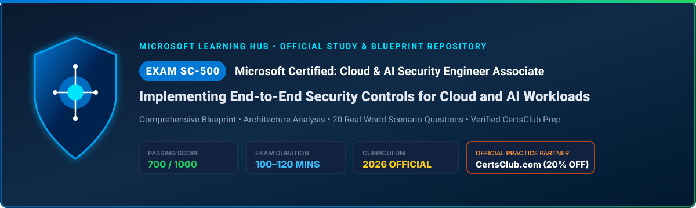

<div align="center">



# 🛡️ Exam SC-500: Implementing End-to-End Security Controls for Cloud and AI Workloads
### Microsoft Certified: Cloud and AI Security Engineer Associate
**Official Study Guide, Technical Blueprint & 20 Real-World Scenario Practice Questions**

[](https://learn.microsoft.com/en-us/credentials/certifications/cloud-and-ai-security-engineer-associate/)
[](https://learn.microsoft.com/en-us/credentials/certifications/resources/study-guides/sc-500)
[-orange?style=for-the-badge&logo=ticket&logoColor=white)](https://www.certsclub.com/microsoft/)
[]()

</div>

---

## 📌 Executive Summary
**Exam SC-500: Implementing End-to-End Security Controls for Cloud and AI Workloads** is Microsoft's premier certification validating modern cybersecurity engineering across hybrid cloud infrastructure and autonomous artificial intelligence workloads.

Earning the **Microsoft Certified: Cloud and AI Security Engineer Associate** credential proves advanced capability to architect, configure, and monitor defense-in-depth security controls across **Identity, Storage, Databases, Networks, Virtual Compute, Container Platforms, Microsoft Copilot, Autonomous Agents (Entra Agent ID), Microsoft Foundry, and Microsoft Security Copilot**.

This repository is maintained by the **Microsoft Learning Hub** community as an exhaustive, technical study companion and practice exam repository.

---

## 📑 Repository Table of Contents

- [🎯 Exam Specifications at a Glance](#-exam-specifications-at-a-glance)
- [📊 Skills Measured & Domain Weightings](#-skills-measured--domain-weightings)
- [🤖 Key AI Security Topics Highlighted on SC-500](#-key-ai-security-topics-highlighted-on-sc-500)
- [📝 20 Real-World Scenario Demo Questions](#-20-real-world-scenario-demo-questions)
- [📁 Detailed Modular Documentation](#-detailed-modular-documentation)
- [🚀 Recommended Study Plan & Official Resources](#-recommended-study-plan--official-resources)
- [🎁 Practice Test Partner: CertsClub (20% OFF)](#-practice-test-partner-certsclub-20-off)

---

## 🎯 Exam Specifications at a Glance

| Attribute | Official Specification |
| :--- | :--- |
| **Exam Code** | **SC-500** |
| **Credential Title** | **Microsoft Certified: Cloud and AI Security Engineer Associate** |
| **Vendor** | **Microsoft Corporation** |
| **Passing Score** | **700 / 1000** (Scaled Score) |
| **Exam Duration** | **100 – 120 Minutes** |
| **Number of Questions** | **40 – 60 Questions** |
| **Question Types** | Multiple Choice (Single/Multi-select), Drag-and-Drop, Case Studies, Hot Areas, Sequence Ordering |
| **Open Book Resource** | Access to official Microsoft Learn documentation allowed during exam |
| **Official Study Guide** | [Microsoft Learn SC-500 Guide](https://learn.microsoft.com/en-us/credentials/certifications/resources/study-guides/sc-500) |
| **Credential Portal** | [Microsoft Credentials: Cloud & AI Security Engineer](https://learn.microsoft.com/en-us/credentials/certifications/cloud-and-ai-security-engineer-associate/) |
| **Verified Practice Partner** | **[CertsClub (www.certsclub.com)](https://www.certsclub.com/microsoft/)** *(Coupon: `club20`)* |

---

## 📊 Skills Measured & Domain Weightings

```
+─────────────────────────────────────────────────────────────────────────────+
|                          EXAM SC-500 DOMAIN BREAKDOWN                       |
+─────────────────────────────────────────────────────────────────────────────+
| [Domain 1] Manage Identity, Access, and Governance            |  20 – 25%   |
| [Domain 2] Secure Storage, Databases, and Networking          |  25 – 30%   |
| [Domain 3] Secure Compute (including AI Workloads)            |  20 – 25%   |
| [Domain 4] Manage and Monitor Security Posture                |  20 – 25%   |
+─────────────────────────────────────────────────────────────────────────────+
```

### Quick Domain Summary:
1. **Manage Identity, Access, and Governance (20–25%)**
   - Microsoft Entra PIM (Eligible assignments, approval flows, MFA step-up).
   - Conditional Access for Users and Workload Identities.
   - Azure Key Vault (Firewall, Private Endpoints, RBAC permission model, automated key rotation, Defender for Key Vault).
   - Defender CSPM Agentless Secret Scanning.
   - Azure Policy enforcement (Deny & DeployIfNotExists effects), custom roles, and resource locks.
2. **Secure Storage, Databases, and Networking (25–30%)**
   - Azure Storage Account hardening, disable shared keys, enforce TLS 1.3, Defender for Storage with real-time malware analysis.
   - Azure SQL Database platform security, TDE with Customer-Managed Keys (CMK), Always Encrypted, and Auditing.
   - Azure Virtual Network Manager (AVNM) Security Admin Rules overriding NSGs.
   - Microsoft Entra Private Access (Zero Trust Security Service Edge).
   - Azure Firewall Premium (TLS inspection, IDPS Alert & Deny), Private Endpoints, and Private Link.
3. **Secure Compute & AI Workloads (20–25%)**
   - Microsoft Purview DSPM for AI to remediate SharePoint/OneDrive oversharing in Copilot.
   - Microsoft Entra Agent ID governance, dedicated Conditional Access, and Defender XDR blast radius analysis.
   - AI Gateway in Azure API Management for Microsoft Foundry (Token bucket rate limiting, semantic caching, Azure AI Content Safety guardrails).
   - Defender for Servers (Plan 2 agentless scanning, Defender for Endpoint EDR, Just-in-Time [JIT] VM access).
   - Hybrid server protection via Azure Arc.
   - AKS security (Entra Workload ID, Defender for Containers, network policies, ACR vulnerability scanning).
4. **Manage and Monitor Security Posture (20–25%)**
   - Defender CSPM Cloud Security Explorer and Attack Path Analysis.
   - Microsoft Defender External Attack Surface Management (Defender EASM).
   - Microsoft Sentinel workspace architecture, Data Collection Rules (DCRs), Windows Event Forwarding (WEF), and CEF/Syslog.
   - Sentinel Automation Rules and SOAR Playbooks (Azure Logic Apps with managed identity).
   - Microsoft Security Copilot (Workspaces, SCU provisioning, RBAC, plugins, and promptbook automation).

*👉 For the exhaustive subtopic checklist, see [docs/02-skills-measured-and-domains.md](./docs/02-skills-measured-and-domains.md).*

---

## 🤖 Key AI Security Topics Highlighted on SC-500
Unlike traditional cloud security certifications, SC-500 introduces specialized domains testing AI workload security:

- **Microsoft Entra Agent ID:** Assigning dedicated, auditable identities to autonomous agents with targeted Conditional Access policies.
- **Purview DSPM for AI:** Detecting sensitive data leakage, prompt extraction, and overexposed document repositories in Microsoft 365 Copilot.
- **AI Gateway in APIM:** Rate limiting LLM token consumption, protecting backend foundation models against prompt injection, and masking PII.
- **Microsoft Security Copilot:** Configuring administrative workspaces, role permissions, and integrating Sentinel/Defender security plugins.

*👉 For deep architectural diagrams and configuration patterns, see [docs/03-cloud-and-ai-security-architecture.md](./docs/03-cloud-and-ai-security-architecture.md).*

---

## 📝 20 Real-World Scenario Demo Questions
This repository includes **20 high-yield, realistic scenario practice questions** covering all 4 exam domains.

| Question ID | Domain Area | Scenario Topic | Link |
| :---: | :--- | :--- | :---: |
| **Q01** | Domain 1 | Entra PIM temporary elevated access with approval & MFA | [View Question](./docs/04-20-demo-practice-questions.md#question-01) |
| **Q02** | Domain 1 | Conditional Access for Workload Identities | [View Question](./docs/04-20-demo-practice-questions.md#question-02) |
| **Q03** | Domain 1 | Azure Key Vault RBAC, Private Endpoints & Defender | [View Question](./docs/04-20-demo-practice-questions.md#question-03) |
| **Q04** | Domain 1 | Defender CSPM Agentless Secret Scanning | [View Question](./docs/04-20-demo-practice-questions.md#question-04) |
| **Q05** | Domain 1 | Azure Policy 'Deny' enforcement for TLS & Storage | [View Question](./docs/04-20-demo-practice-questions.md#question-05) |
| **Q06** | Domain 2 | Defender for Storage real-time malware & Tor detection | [View Question](./docs/04-20-demo-practice-questions.md#question-06) |
| **Q07** | Domain 2 | Azure SQL TDE with CMK, Always Encrypted & Auditing | [View Question](./docs/04-20-demo-practice-questions.md#question-07) |
| **Q08** | Domain 2 | AVNM Security Admin Rules overriding local NSGs | [View Question](./docs/04-20-demo-practice-questions.md#question-08) |
| **Q09** | Domain 2 | Microsoft Entra Private Access (Zero Trust SSE) | [View Question](./docs/04-20-demo-practice-questions.md#question-09) |
| **Q10** | Domain 2 | Azure Firewall Premium TLS Inspection & IDPS | [View Question](./docs/04-20-demo-practice-questions.md#question-10) |
| **Q11** | Domain 3 | Purview DSPM for AI & Copilot SharePoint overexposure | [View Question](./docs/04-20-demo-practice-questions.md#question-11) |
| **Q12** | Domain 3 | Microsoft Entra Agent ID & Defender XDR Blast Radius | [View Question](./docs/04-20-demo-practice-questions.md#question-12) |
| **Q13** | Domain 3 | AI Gateway in APIM token limits & Content Safety | [View Question](./docs/04-20-demo-practice-questions.md#question-13) |
| **Q14** | Domain 3 | Defender for Servers Plan 2, Agentless & JIT Access | [View Question](./docs/04-20-demo-practice-questions.md#question-14) |
| **Q15** | Domain 3 | AKS security with Entra Workload ID & Defender | [View Question](./docs/04-20-demo-practice-questions.md#question-15) |
| **Q16** | Domain 4 | Defender CSPM Attack Path Analysis & Cloud Graph | [View Question](./docs/04-20-demo-practice-questions.md#question-16) |
| **Q17** | Domain 4 | Defender External Attack Surface Management (EASM) | [View Question](./docs/04-20-demo-practice-questions.md#question-17) |
| **Q18** | Domain 4 | Sentinel ingestion with DCRs & Windows Event Forwarding | [View Question](./docs/04-20-demo-practice-questions.md#question-18) |
| **Q19** | Domain 4 | Sentinel Automation Rules & SOAR Playbooks | [View Question](./docs/04-20-demo-practice-questions.md#question-19) |
| **Q20** | Domain 4 | Microsoft Security Copilot Workspaces & Plugins | [View Question](./docs/04-20-demo-practice-questions.md#question-20) |

*👉 Review the complete set of questions with in-depth technical explanations in [docs/04-20-demo-practice-questions.md](./docs/04-20-demo-practice-questions.md).*

---

## 📁 Detailed Modular Documentation

- 📄 **[01. Exam Overview & Candidate Profile](./docs/01-exam-overview.md)** — Exam structure, scoring rules, time limits, and prerequisites.
- 📄 **[02. Skills Measured & Domain Blueprint](./docs/02-skills-measured-and-domains.md)** — Exhaustive line-by-line curriculum breakdown.
- 📄 **[03. Cloud & AI Security Architecture Deep Dive](./docs/03-cloud-and-ai-security-architecture.md)** — Architectural diagrams, AI Gateway patterns, Entra Agent ID, and Zero Trust networking.
- 📄 **[04. 20 Demo Practice Questions & Detailed Rationale](./docs/04-20-demo-practice-questions.md)** — 20 full-length scenario questions with verified answers.
- 📄 **[05. Study Resources & Preparation Guide](./docs/05-study-resources-and-preparation.md)** — 4-week study plan, hands-on lab sandboxes, and practice exam links.

---

## 🚀 Recommended Study Plan & Official Resources

1. 📖 **Official Learning Paths:** Study the self-paced courses on [Microsoft Learn](https://learn.microsoft.com/en-us/credentials/certifications/cloud-and-ai-security-engineer-associate/).
2. 🔬 **Explore the Exam Sandbox:** Test the Pearson VUE exam engine on the [Interactive Microsoft Exam Sandbox](https://aka.ms/exam-sandbox).
3. 🧪 **Hands-on Labs:** Spin up developer sandboxes to configure Azure Key Vault RBAC, AVNM Security Admin Rules, Entra PIM, and Defender for Cloud CSPM.

---

## 🎁 Practice Test Partner: CertsClub (20% OFF)

For complete simulation practice tests, authentic case studies, and updated question banks:

- 🌐 **Official Store:** [https://www.certsclub.com/microsoft/](https://www.certsclub.com/microsoft/)
- 🎟️ **Exclusive Discount Code:** `club20` *(Apply at checkout for 20% OFF)*
- **Features Included:**
  - Full Question Pool matching the updated May 2026 blueprint.
  - Timed Exam Simulator software replicating Pearson VUE.
  - Mobile-ready & Printable PDF formats.
  - 90 days of free question updates.

---

### 🛡️ Disclaimer
*This repository is an independent study guide and community resource developed under Microsoft Learning Hub. Microsoft, Azure, Entra, Microsoft Sentinel, Microsoft Purview, and Copilot are registered trademarks of the Microsoft group of companies.*
